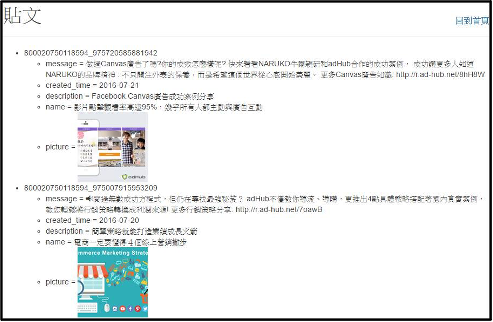

# 取得貼文清單

- 輸入參數1：公開粉絲專頁或FB USER ID
- 輸入參數2：指定抓取的欄位
- 輸入參數3：最大抓取數量
- 輸入參數4：存至DB 或檔案
- 輸出結果： 儲存到DB或JSON檔案，顯示貼文列表

進入後會顯示登入按鈕，按下登入後會跳至Facebook頁面詢問是否要授權給我的App。

取得授權後就會跳至歡迎畫面，可選取要抓取哪種貼文、抓取數量以及抓取欄位，還有是否要存入DB或檔案。

按下送出後，會從最新的貼文開始抓取，顯示每篇貼文的欄位資料。
若有勾選存入資料庫，在送出時就會將這些資料存至DB；若是勾選存成檔案，在貼文顯示畫面會多了下載檔案按鈕，讓使用者下載JSON格式的檔案。

